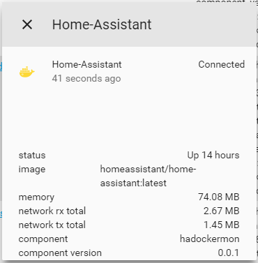

# Binary sensor for [ha-dockermon](https://github.com/philhawthorne/ha-dockermon)

A custom binary_sensor platform which allows you get sensor data from [ha-dockermon.](https://github.com/philhawthorne/ha-dockermon)

This platform will **only** give you sensor data, if you also want to controll the containers as switches have a look at [switch.hadockermon](https://github.com/custom-components/switch.hadockermon)  
  
To get started put `/custom_components/hadockermon/binary_sensor.py` here:  
`<config directory>/custom_components/hadockermon/binary_sensor.py`  
  
**Example configuration.yaml:**
```yaml
binary_sensor:
  platform: hadockermon
  host: 192.168.1.50
  port: 8126
  stats: true
  device_name: hadockermon
  containers:
    - 'NGINX'
    - 'ha-dockermon'
```
**Configuration variables:**  
  
key | description  
:--- | :---  
**platform (Required)** | The platform name.  
**host (Required)** | The IP address of your Docker host.  
**port (Optional)** | The port that the service is exposed on.  
**stats (Optional)** | Show memory and network usage of the containers, this does _not_ work on every docker host.  
**device_name (Optional)** | A string that will prefix the entity name, for easy sort and grouping.  
**containers (Optional)** | A list of Docker containers you want to show, by default it shows all.
  
#### Sample overview


  
To start using this make sure you have [ha-dockermon](https://github.com/philhawthorne/ha-dockermon) running.  
  
***
Due to how `custom_componentes` are loaded, it is normal to see a `ModuleNotFoundError` error on first boot after adding this, to resolve it, restart Home-Assistant.
